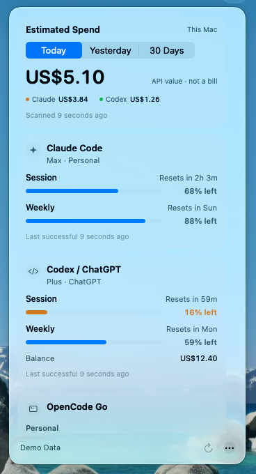
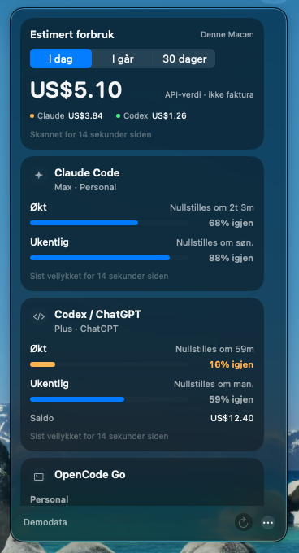

# OpenQuota

A small, fast macOS menu-bar app that shows how much AI-provider usage you have left — per provider, **per account**.

One card per provider, with separate readings for each account. Choose the lowest
remaining percentage, pin an account/window, or keep the menu bar icon-only.

[Download](https://github.com/henrikogaard/openquota/releases/latest) ·
[Account guide](docs/accounts.md) · [Troubleshooting](docs/troubleshooting.md) ·
[Privacy](docs/privacy.md) · [Development](docs/development.md) · [Design](DESIGN.md)

## Screenshots

<p align="center">
  
  
</p>

Native macOS screenshots with synthetic **Demo Data**: English in light appearance
and Norwegian Bokmål in dark appearance. These illustrate the UI, not live
provider accuracy. Estimated spend is API-rate value, not a subscription bill.

## Getting started

1. Download the DMG from [Releases](https://github.com/henrikogaard/openquota/releases/latest),
   drag OpenQuota to Applications, and launch it on **macOS 26 Tahoe or later**.
2. Click the menu-bar gauge → **Options (…) → Settings… → Accounts → +**.
3. Pick a provider and its connection method. Add a separate labeled entry for
   each subscription or workspace.
4. Under **General → Menu Bar**, choose icon only, percentage only, icon +
   percentage, or provider + percentage, and optionally pin an account/window.

The automatic reading is the **lowest** eligible percentage, not an average or
combined balance. Cached readings can participate and are dimmed. A missing
pinned source shows **—**, never a different account. Meters show what's left;
balances, activity, and estimated spend remain separate.

English and Norwegian Bokmål are supported. OpenQuota lives in the menu bar,
not a normal Dock window. Check for updates through the Options menu.

## Why another one

OpenQuota prioritizes a small native UI, independent account state and bounded background work:

- **No automatic browser-cookie import.** Providers use API keys, local CLI sources, or explicit connections. Cursor is an opt-in exception using a manually supplied session and unofficial endpoints.
- **Optional local spend estimates.** Opt in to a bounded Claude/Codex log scan for Today, Yesterday and 30 Days. This estimates API-rate value, not subscription charges; prompts are not retained and nothing is uploaded. [Pricing and privacy](docs/estimated-spend.md).
- **Shared ephemeral URLSession.** Four concurrent account fetches; last-good snapshots replace old values rather than accumulating history.
- **Hard timeouts.** 15s request / 30s resource / 60s per-fetch ceiling. A blocked network fails fast instead of hanging.

## Providers

Each saved key/session has its own row. Other local providers discover their default CLI login; OpenCode, Devin and Grok also support labeled **credential-file profiles**. Claude and Codex use explicit connections under Settings → Accounts → +.

| Provider | Status | Source |
|---|---|---|
| Claude Code | Passive status line | Sanitized documented status-line readings; updates while you use Claude Code |
| Codex / ChatGPT | Managed CLI sign-in | Codex app-server subscription limits and credits; isolated Codex home per connection |
| OpenCode Go | Local API key | Rolling, weekly and monthly usage |
| Devin | Local CLI credentials | Daily/weekly remaining percentage and extra-usage balance |
| Grok | Local OAuth | Billing-period usage; named local accounts |
| Cursor | Experimental, manual session token | Cursor Models / Other Models allowance and on-demand spend; internal dashboard with legacy RPC fallback |
| OpenRouter | API key | Remaining account credits and independent key usage/limit |
| Requesty | Management API key | Organization balance |
| Additional / custom providers | Specs and CLI adapters | See [provider details](docs/providers.md) |

**Mistral personal Vibe allowance is not supported.** The legacy Admin-analytics
connector measures workspace activity, not personal allowance. Do not create
Studio or Admin keys for this purpose. Mistral is temporarily hidden from setup
and usage, with no background polling. Saved accounts and Keychain entries are
retained.

Provider mappings are fixture-tested, **not a claim that every provider has been verified with a live paid account**. Other providers' endpoints may change; errors retain the last good reading and mark it outdated. Claude and Codex use the documented integration surfaces linked in [provider details](docs/providers.md); their fixture tests do not replace live paid-account validation.

Custom providers are added by dropping a `ProviderSpec` JSON array into `~/Library/Application Support/openquota/provider-specs.json` — no code needed for bearer-key + JSON-usage-endpoint services. Quit and relaunch OpenQuota after editing the file to load the new definitions.

## Build & run

macOS 26 Tahoe+, Xcode 26 / Swift 6.2 toolchain for the app (core builds with Swift 6.1 on Linux):

```bash
scripts/bundle.sh        # builds + assembles dist/OpenQuota.app (ad-hoc signed for dev)
swift test               # core suite — also runs on Linux
```

For development: `swift run openquota` shows the menu-bar item without an app bundle (icon may render in the Dock until bundled as a `.app` with `LSUIElement`).
Run `swift build` before installing the Claude status-line integration during development so the sibling `openquota-bridge` executable is available.

To review populated cards without credentials:

```bash
open dist/OpenQuota.app --args --demo
```

Quit an existing instance first. Demo mode uses synthetic data, performs no account fetches and disables credential changes.

## Accounts and privacy

Settings → Accounts → + accepts API keys, manually pasted Cursor sessions, or a local credential-file path for supported providers. Saved secrets use device-only, non-synchronizable macOS Keychain entries; profile files store only labels and paths. Saved API-key/session accounts can be renamed, replaced, or removed. Removing a local profile never deletes its provider-owned credential file. See the [privacy guide](docs/privacy.md).

Claude Code connection requires Claude Code and an existing config directory. OpenQuota installs a reversible status-line wrapper that keeps the existing command and unrelated settings. It stores only sanitized quota percentages and reset times from Claude's documented status-line input; it makes no quota requests. Readings follow whichever login is active in that configuration, and become outdated after ten minutes without a new Claude Code response. Disconnect restores the prior status-line object only if the installed command is still unchanged. Separate Claude configs/logins are needed for separate connections.

Codex connection requires the Codex CLI. “Sign in with ChatGPT” runs Codex's documented app-server flow in a dedicated app-managed `CODEX_HOME`, independent for each connection. OpenQuota does not read or copy `auth.json`; Codex manages its own sign-in files. API keys are for separate API billing and do not provide ChatGPT subscription quotas. Removing a Codex connection removes it from OpenQuota but retains Codex-managed files in that dedicated home.

Older Claude/Codex credential-file profiles remain listed as **Reconnect required** but are no longer read. Remove those profiles and add the account from Settings → Accounts → +. Other supported providers may update their own credential file with refreshed tokens; use a separate, stable file per extra login. Duplicating a file does not create a new provider account.

Requests time out, HTTP response bodies are capped at 2 MiB on macOS, local credential files at 1 MiB, and the on-disk snapshot cache at 256 KiB. Subscription connection metadata is secret-free and capped at 100 entries. Saved keys and local profiles have count limits. Rate limits honor `Retry-After`, including during manual refresh. A five-minute refresh cadence and exponential backoff avoid aggressive polling. These bounds reduce risk; they are not a substitute for a long-running memory soak test.

## Auto-update & releases

Sparkle 2.x, same setup as linkrouter: the app checks `releases/latest/download/appcast.xml` (EdDSA-signed updates), and each `v*` tag runs `release.yml` — sign (Developer ID) → notarize → dmg → appcast → GitHub release.

Release secrets/vars to configure on the repo (Apple signing credentials may be shared with linkrouter; use OpenQuota's own Sparkle key):
`DEVELOPER_ID_P12`, `DEVELOPER_ID_P12_PASSWORD`, `APPSTORE_API_PRIVATE_KEY` (secrets); `APPLE_TEAM_ID`, `APPSTORE_API_KEY_ID`, `APPSTORE_ISSUER_ID` (vars); `SPARKLE_PRIVATE_ED_KEY` (secret — EdDSA private key matching the public key in `Resources/Info.plist`).

Only tag an approved release after configuring signing/notarization and update-signing credentials. A development ad-hoc bundle is not a signed, notarized distribution. A successful appcast request is not evidence of a successful update installation.

## Repo layout

```
Sources/OpenQuotaCore/   # providers, models, refresh engine — pure Foundation
Sources/OpenQuota/       # macOS menu-bar shell (SwiftUI MenuBarExtra)
Tests/OpenQuotaCoreTests/
docs/providers.md        # researched endpoint/auth matrix for every provider
DESIGN.md                # UI tokens
```

## Resource design

| Risk | Our rule |
|---|---|
| Multi-GB scan-cache artifact | Bounded snapshot cache; optional local log scanning has separate file/byte/event/time budgets and an in-memory parsed cache |
| WebKit helper leaks | Zero WebKit anywhere |
| Per-poll allocation growth | Shared URLSession; snapshots are value types; account pruning |
| Hung fetches (7-day timeouts) | Explicit request/resource/fetch timeouts, `waitsForConnectivity = false` |

## Contributing and verification

Keep changes focused and all user-facing copy available in English and Norwegian.
Never commit credentials, raw provider responses, or actual account screenshots.
Run `swift build` and `swift test`; CI runs these on Linux. There is no separate
configured Swift linter. Linux cannot compile the SwiftUI/AppKit paths.

For app changes, also build and inspect the bundled app on macOS: light/dark,
English/Norwegian, long labels, empty/error/stale states, keyboard navigation,
and all menu-bar display modes. Demo mode cannot test credential editing; use
an isolated synthetic fixture environment, not real user credentials.

Fixtures prove parser behavior, not live quota accuracy. Report resource samples
with duration and workload; a short sample does not establish leak-free behavior.
Real sleep/wake and signed update/relaunch need separate native validation.

## License

[MIT](LICENSE), copyright Henrik Øgård. Bundled pricing resources retain their
upstream notices; see [estimated spend](docs/estimated-spend.md).
